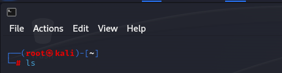
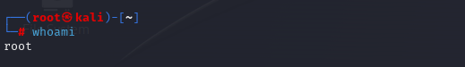
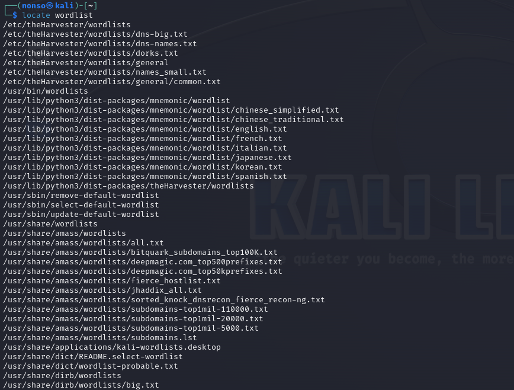
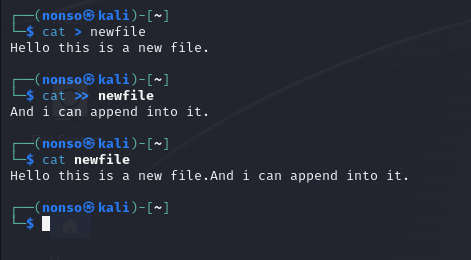
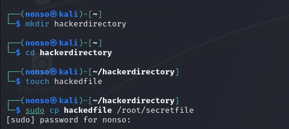
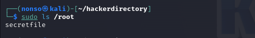

# Chapter 1 Notes

Change Directory

`cd /etc`

`cd ..` to move up one level

`cd ../..` to move up two levels

`cd ../../..` to move up one level

Checking your login

`whoami`

Print working directory

`pwd`

List contents of the directory

`ls`
List files and directories

`ls -l`

List hidden files

`ls -la`

Search with find

`find / -type f -name apache2`

Filter with grep

`ps aux | grep apache2`

Create a file with cat

`cat > file`

Append a file

`cat >> file`

Overrite a file with cat

`cat > file`

Create a file with touch

`touch newfile`

Create a directory

`mkdir directory`

Copy a file

`touch oldfile`
`cp oldfile /folder/newfile`

Renaming a file

`mv newfile newfile2`

Remove a file

`rm oldfile`

Remove empty directory

`rm olddir`

Remove directory

`rm -r olddir`

# Exercises

1. Use the ls command from the root(/) directory to explore the directory structure of Linux. Move to each of the directories with the cd command and run pwd to verify where you are in the directory structure.

2. Use the whoami command to verify which user you are logged in as.

3. Use the locate command to find wordlists that can be used for password cracking.

4. Use the cat command to create a new file and then append to that file. Keep in mind that > redirects input to a file and >> appends to a file.

5. Create a new directory called hackerdirectory and create a new file in that directory named hackedfile. Now copy that file to your /root directory and rename it secretfile.

