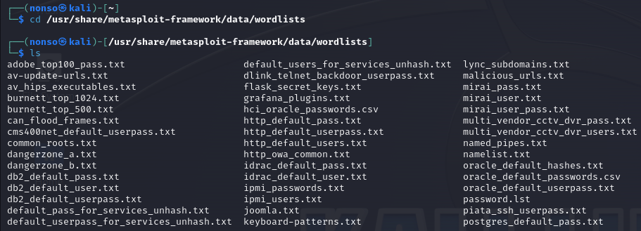
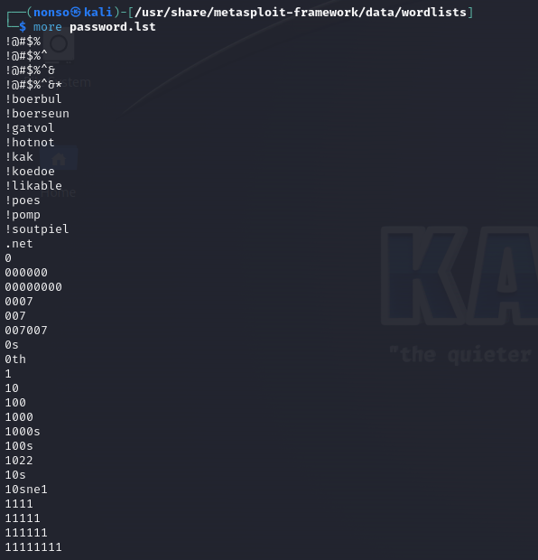
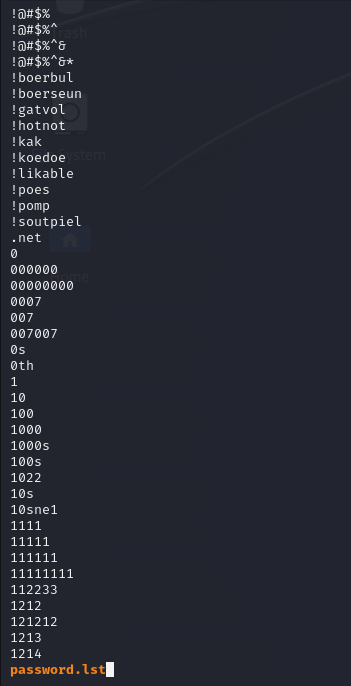
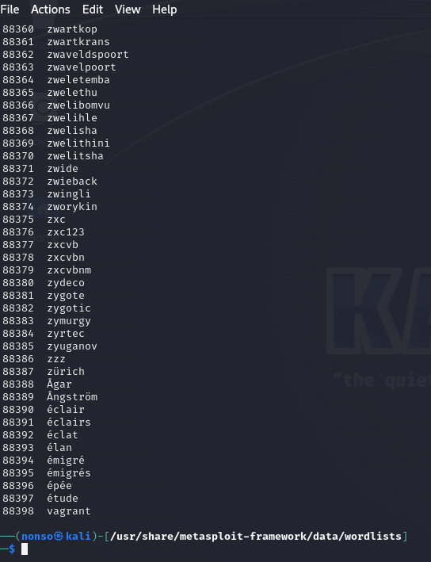
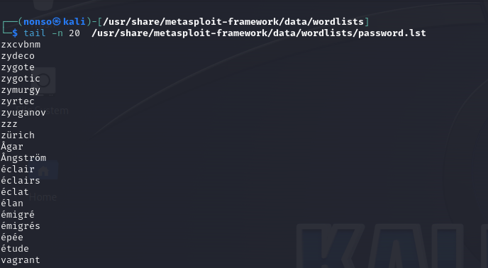
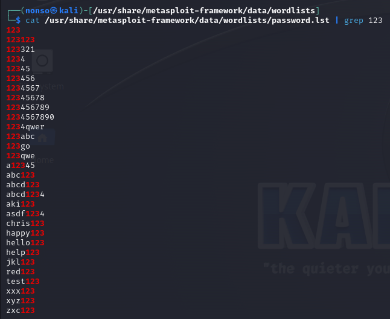

# Chapter 2 Notes

Viewing Files

`cat /etc/snort/snort.conf`

Finding the Head

`head /etc/snort/snort.conf`

`head -20 /etc/snort/snort.conf` for the first 20 lines 

Finding the tail

`tail /etc/snort/snort.conf`

`tail -20 /etc/snort/snort.conf` for the last 20 lines

Numbering the Lines

`nl /etc/snort/snort.conf`

Filtering Text with grep

`cat /etc/snort/snort.conf | grep output`

Using sed to find and replace

`sed s/mysql/MYSQL/g /etc/snort/snort.conf > snort2.conf`

The s command performs the substitution, the g flag tells Linux that you want the replacement performed globally.

`sed s/mysql/MYSQL/2 snort.conf snort2.conf`

The above command replaces only the second occurrence of the word mysql.

Viewing Files with more and less

`more /etc/snort/snort.conf`

Displaying and Filtering with less

`less /etc/snort/snort.conf`

# Exercises

1. Navigate to /usr/share/metasploit-framework/data/wordlists.

2. Use the more command to display the contents of the password.lst

3. Use the less command to display the contents of the password.lst

4. Now use the nl command to place line numbers on the passwords in password.lst. There should be about 88,396 passwords.

5. Use the tail command to see the last 20 passwords in password.lst 

6. Use the cat command to display password.lst and pipe it to find all the passwords that contain 123.

