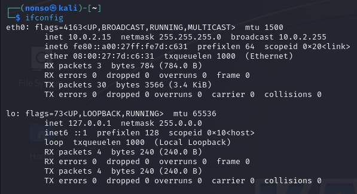

# Chapter 3 Notes

To get network information

`ifconfig` 

To get information on wireless adapters

`iwconfig` 

To change your IP address, enter ifconfig followed by the interface you want and the new IP address you want for that interface

`ifconfig eth0 192.168.181.115`

To change your Network Mask and Broadcast address with the ifconfig

`ifconfig eth0 192.168.181.115 netmask 255.255.0.0 broadcast 192.168.1.255`

Spoofing your MAC address: To spoof your MAC address, simply use the ifconfig command's down option to take down the interface(eth0). then enter the ifconfig followed by interface name(hw for hardware, ether for ethernet) and the new spoofed MAC address. Finally bring the interface back up with the up option.

`ifconfig eth0 down`

`ifconfig eth0 hw ether 00:11:22:33:44:55`

`ifconfig eth0 up`

Examining DNS with dig and use the ns option for nameservers

`dig hackers-arise.com ns`

Examining DNS with dig and use the mx option for domain mail exchange

`dig hackers-arise.com mx`

Changing your DNS server: Edit the file names /etc/resolv.conf and replace the nameservers with the new nameservers.

`vi /etc/resolv.conf`

The same can also be achieved by the following command

`echo "nameserver 8.8.8.8"> /etc/resolv.conf`

Map your own IP address

`vi /etc/hosts`

# Exercises

1. Find information on your active network interfaces.

2. Change the IP address on eth0 to 192.168.1.1

3. Change your hardware address on eth0.

4. Check whether you have any available wireless interfaces active.

5. Reset your IP address to a DHCP-assigned address.

6. Find the nameserver and email server of your favorite website.

7. Add google's DNS server to your /etc/resolv.conf file so your system refers to that server when it can't resolve a domain name query.

