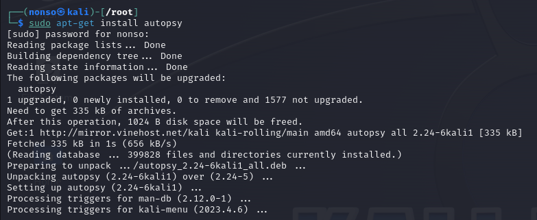
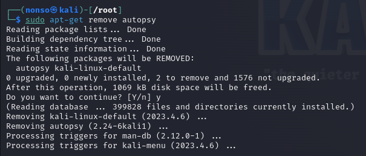
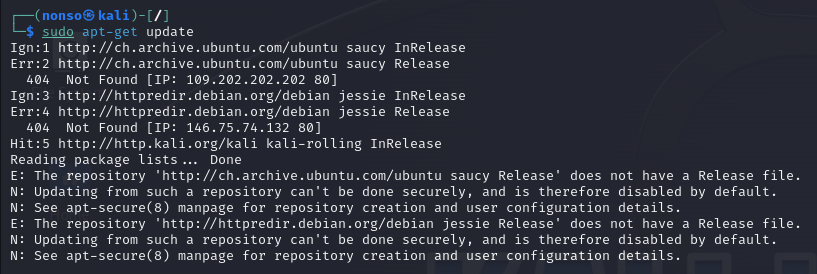
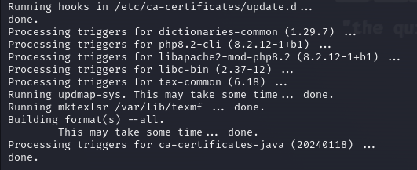

# Chapter 4 Notes

Searching for a package

`apt-cache search keyword`

Adding Software

`apt-get install snort`

Removing Software

`apt-get remove snort`

Updating Packages

`apt-get update`

Ugrading Packages

`apt-get upgrade`

Adding Repositories to your source.list file

`vi /etc/apt/sources.list`

# Exercises

1. Install a new software package from the kali repo.

2. Remove that same software package.

3. Update your repository.

4. Upgrade your software packages.

5. Select a new piece of software from github and clone it to your system.

