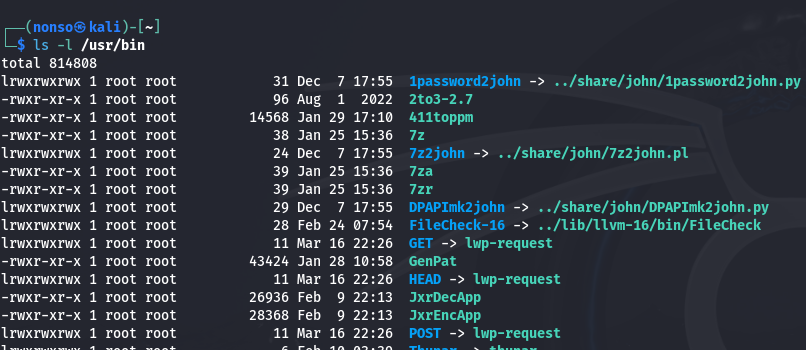

# Chapter 5 Notes

Grant ownership to an individual

`chown bob /tmp/filename`

Grant ownership to a Group

`chgrp security newIDS`

Checking permissions

`ls -l /tmp`

Changing permissions

`chmod 777 filename`

Changing permissions with UGO

`chmod u-w filename` removes write permission from the user

# Exercises

1. Select a directory and run a long listing on it.

