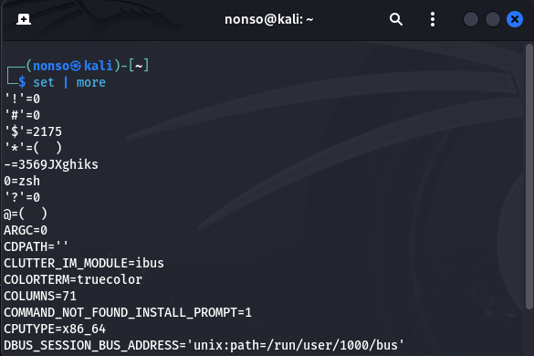
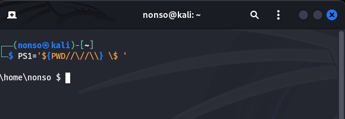
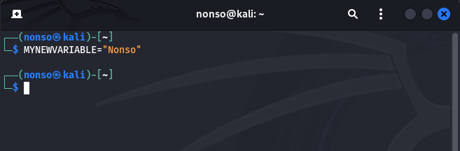
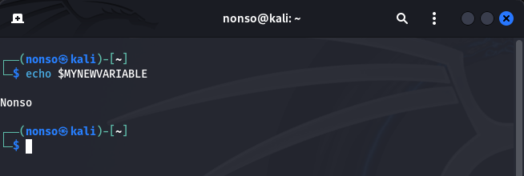
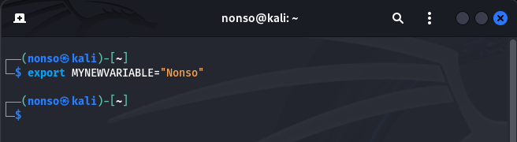
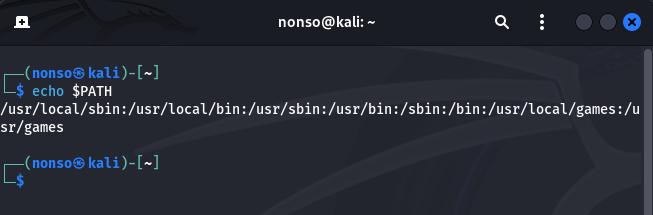
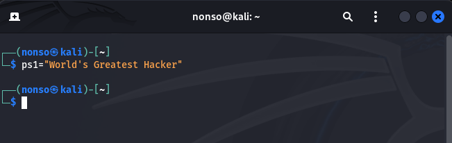

# Exercises 

1. View all of your environment variables with the more command.

`set | more`

2. Find a method to change the slash(/) to a backslash (\) in the faux microsoft cmd PS1.

`PS1='${PWD//\//\\} \$ '`

 3. Create a variable named MYNEWVARIABLE and put your name in it.

 `MYNEWVARIABLE="Nonso"`

 

 4. Use echo to view the contents of MYNEWVARIABLE.

 `echo $MYNEWVARIABLE`

 

 5. Export MYNEWVARIABLE so that it's available in all environments.

 `export MYNEWVARIABLE="Nonso"`

 

 6. use the echo command to view the contents of the PATH variable

 `echo $PATH`

 

 7. Change your PS1 variable  to "World's Greatest Hacker".

 `PS1="World's Greatest Hacker"`

 